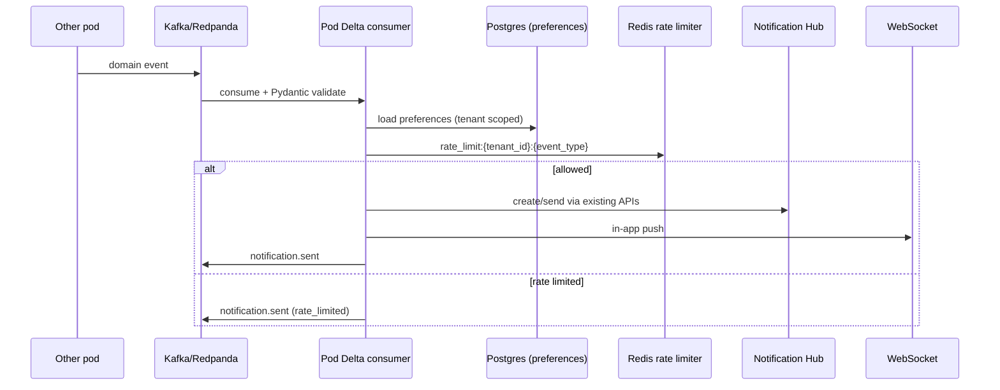
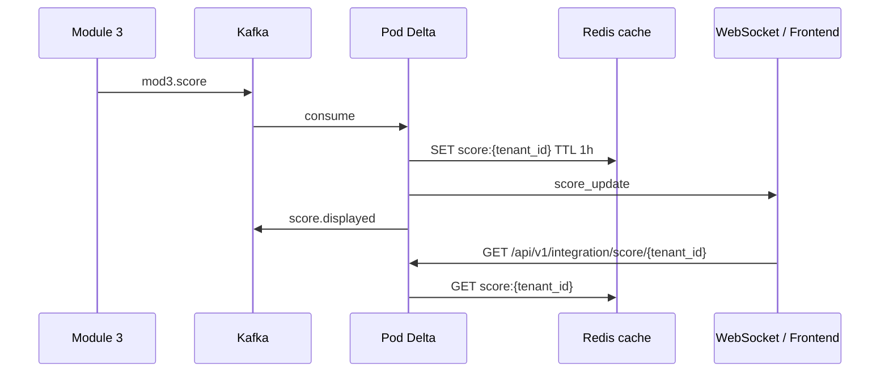
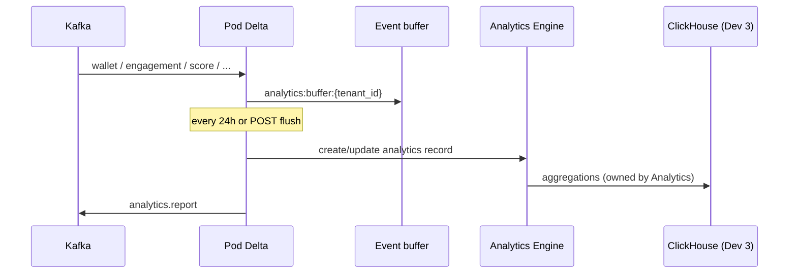

IMPORTANT NOTES REGARDING THE FRONT-END/Manual 

NOTE – The cyberarena.zip file contains the entire files/folders required to run the .jsx file kindly unzip it. If you’re not able to unzip the file then there are other files along with the main .jsx file, to run that jsx file you have to follow the process below.
•	.jsx file - file is a JavaScript file that contains JSX (JavaScript XML) syntax, which allows developers to write HTML-like markup directly inside JavaScript code. It is primarily used in React to build user interfaces and define reusable UI components.

1.	The initial file was generated and later on it was edited function by function.
2.	Vite - Vite is a modern, ultra-fast frontend build tool used to develop, and build web applications like React.
a.	React itself is a JavaScript library for building user interfaces. However, browsers cannot natively read React code (like JSX or TypeScript) without it being processed first. Vite manages this entire behind-the-scenes engineering process.
b.	Development Server: It spins up a local testing environment so you can view your React app in a browser while coding.
c.	Code Transpilation: It converts your modern React syntax, JSX, and CSS into standard JavaScript that any browser can understand.

3.	To run the .JSX file you need to do the following steps (SKIP THIS IF YOU ALREADY HAVE THE ENTIRE FOLDER).
a.	Create a React Project First using your cmd - 
i.	cd (<your folder where .jsx file is present>)
ii.	npm create vite@latest cyberarena -- --template react
iii.	npm install
iv.	npm run dev
v.	Then copy your .jsx file into the /src of /cybersrena
 
b.	Use Vs code and any browser to run to code successfully.
4.	Install node.js if not installed - https://nodejs.org/en/download (REQUIRED TO RUN THE CODE). 
a.	During installation, make sure "Add to PATH" is checked.
b.	Verify the installation in VS code – open cmd in vs code & run “node -v” then “npm -v”.
5.	Then navigate to your Project folder in vs code.
6.	Then in cmd after react project creation, navigate to the folder where the .jsx file is present in my pc it was present in /bb/cyberarena & run the command “npm run dev”.
 
7.	The copy the url & paste it in your browser, you’ll be able to view the interface.

•	If you have the unzipped folder with you then you need to follow the steps from 4 to 7. (installing node.js if not installed, then verify the installation) 


# CyBreach Notification Hub

## 1. Overview

The CyBreach Notification Hub is the backend notification service developed for Pod Delta.

It provides REST APIs for creating, managing, tracking, and analyzing user notifications. It also provides APIs for managing user notification preferences across different communication channels.

The service is built using FastAPI and SQLAlchemy and currently uses SQLite as the development database.

## 2. Objectives

The Notification Hub is responsible for:

- Creating notifications for users
- Retrieving notifications
- Retrieving notifications for a specific user
- Tracking unread notifications
- Marking notifications as read
- Updating notification status
- Updating and deleting notifications
- Performing bulk notification operations
- Providing notification statistics for analytics
- Managing user notification preferences
- Supporting multiple notification channels
- Supporting notification priority levels
- Providing API documentation through Swagger UI

## 3. Technology Stack

| Component | Technology |
|---|---|
| Programming Language | Python |
| Backend Framework | FastAPI |
| ORM | SQLAlchemy |
| Validation | Pydantic |
| Database | SQLite |
| API Documentation | Swagger / OpenAPI |
| Server | Uvicorn |

### Responsibilities

**api/**  
Contains the API routes and endpoints.

**core/**  
Contains application configuration and exception handling.

**database/**  
Contains the SQLAlchemy database connection and session management.

**models/**  
Contains the database models.

**schemas/**  
Contains Pydantic schemas used for request validation and API responses.

**services/**  
Contains the business logic for notifications and preferences.

**main.py**  
Initializes the FastAPI application, middleware, exception handlers, database tables, and API routers.

## 5. Notification Model

Each notification contains:

- Notification ID
- User ID
- Title
- Message
- Channel
- Priority
- Status
- Read status
- Creation timestamp
- Update timestamp
- Read timestamp
- Delivery timestamp

### Supported Channels

- Email
- SMS
- Push
- In-app
- Webhook
- WhatsApp
- Telegram

### Supported Priorities

- Low
- Medium
- High
- Urgent
- Critical

### Supported Statuses

- Pending
- Sent
- Delivered
- Read
- Failed
- Cancelled

## 6. Notification APIs

Base path:

/api/v1/notifications

### Create Notification

POST /api/v1/notifications/

Creates a new notification.

Example request:

{
  "user_id": 1,
  "title": "Security Alert",
  "message": "Suspicious login detected",
  "channel": "email",
  "priority": "high"
}

### Get All Notifications

GET /api/v1/notifications/

Supports pagination, user filtering, status filtering, channel filtering, priority filtering, read/unread filtering, search, date filtering, and sorting.

### Get User Notifications

GET /api/v1/notifications/user/{user_id}

Returns notifications belonging to a specific user.

### Get Unread Notifications

GET /api/v1/notifications/unread

Returns unread notifications.

### Get Unread Count

GET /api/v1/notifications/unread/count

Returns the number of unread notifications.

### Get Notification Statistics

GET /api/v1/notifications/stats

Provides notification statistics including total, read, unread, channel, priority, and status information.

This endpoint can be consumed by the analytics/dashboard component.

### Update Notification

PUT /api/v1/notifications/{notification_id}

Updates an existing notification.

### Delete Notification

DELETE /api/v1/notifications/{notification_id}

Deletes a notification.

### Mark Notification as Read

PATCH /api/v1/notifications/{notification_id}/read

Marks a notification as read.

### Update Notification Status

PATCH /api/v1/notifications/{notification_id}/status

Updates the status of a notification.

### Bulk Mark as Read

PATCH /api/v1/notifications/bulk/read

Marks multiple notifications as read in a single request.

Example request:

{
  "notification_ids": [1, 2, 3],
  "is_read": true,
  "status": "read"
}

### Bulk Delete

DELETE /api/v1/notifications/bulk

Deletes multiple notifications in a single request.

## 7. Notification Preference APIs

Base path:

/api/v1/preferences

User preferences control how and when notifications are delivered.

### Create Preferences

POST /api/v1/preferences/

Creates notification preferences for a user.

### Get Preferences

GET /api/v1/preferences/{user_id}

Returns notification preferences for a specific user.

### Update Preferences

PUT /api/v1/preferences/{user_id}

Updates notification preferences.

## 8. Preference Features

The preference system supports:

- Email notifications
- SMS notifications
- In-app notifications
- Push notifications
- Webhook notifications
- WhatsApp notifications
- Telegram notifications
- Low-priority notifications
- Medium-priority notifications
- High-priority notifications
- Urgent notifications
- Critical notifications
- Quiet hours
- Digest notifications
- Notification frequency
- Global unsubscribe

## 9. API Versioning

The current API version is:

/api/v1

API versioning allows future API versions to be introduced without breaking existing clients.

## 10. Health Checks

### Root Health Check

GET /

Checks whether the Notification Hub backend is running.

### Detailed Health Check

GET /api/v1/health

Returns the current application health status.

Example response:

{
  "status": "healthy",
  "application": "CyBreach Notification Hub",
  "version": "1.0.0",
  "environment": "development"
}

## 11. API Documentation

Swagger UI:

http://127.0.0.1:8000/api/docs

OpenAPI specification:

http://127.0.0.1:8000/api/openapi.json

ReDoc:

http://127.0.0.1:8000/api/redoc

## 12. Running the Backend

Create a virtual environment:

python -m venv venv

Activate it:

venv\Scripts\activate

Install dependencies:

pip install -r requirements.txt

Start the server:

uvicorn app.main:app --reload

The backend will be available at:

http://127.0.0.1:8000

Swagger documentation:

http://127.0.0.1:8000/api/docs

## 13. Database

The current development environment uses SQLite.

Database:

cybreach.db

SQLAlchemy is responsible for creating and interacting with the database tables.

The database file should not be committed to the repository.

## 14. Error Handling

The backend includes centralized exception handling for:

- HTTP exceptions
- Request validation errors
- Unexpected server errors

Validation errors return structured responses so API clients can understand why a request failed.

## 15. Testing and Verification

The backend was verified using the FastAPI Swagger interface.

The following functionality was tested:

- Health check
- Notification creation
- Notification retrieval
- User notification retrieval
- Unread notification retrieval
- Unread notification count
- Notification statistics
- Notification update
- Notification deletion
- Marking notifications as read
- Notification status updates
- User preference creation
- User preference retrieval
- User preference updates
- Bulk notification operations

The API returned successful HTTP responses during verification.
# CyBreach Analytics Engine

The CyBreach Analytics Engine is a backend service that collects, stores, and provides analytics data for the CyBreach Arena platform.

## Technologies

- Python
- FastAPI
- SQLAlchemy
- SQLite
- Pydantic
- Pydantic Settings
- Alembic

## Features

- Analytics record creation and management
- Dashboard analytics
- Credit flow analysis
- User engagement analysis
- Resilience score
- Resilience score trend
- Monthly analytics reports
- Pagination
- Filtering by tenant, report month, date range, and score
- Input validation
- Error handling
- CORS configuration
- Swagger API documentation

## API Endpoints

### Analytics CRUD

- `POST /api/v1/analytics`
- `GET /api/v1/analytics`
- `GET /api/v1/analytics/{id}`
- `GET /api/v1/analytics/tenant/{tenant_id}`
- `PUT /api/v1/analytics/{id}`
- `DELETE /api/v1/analytics/{id}`

### Analytics Services

- `GET /api/v1/analytics/dashboard/{tenant_id}`
- `GET /api/v1/analytics/credit-flow/{tenant_id}`
- `GET /api/v1/analytics/engagement/{tenant_id}`
- `GET /api/v1/analytics/score/{tenant_id}`
- `GET /api/v1/analytics/score-trend/{tenant_id}`
- `GET /api/v1/analytics/report/{tenant_id}`

## Analytics Data

Each analytics record contains information such as:

- Tenant details
- Resilience score
- Credit balance and usage
- Total and active users
- Total visits
- Average session duration
- Average response time
- Uptime percentage
- Error count
- Additional metrics
- Report month
- Created and updated timestamps

## Pagination and Filtering

The analytics listing API supports pagination and filtering.

Available parameters include:

- `skip`
- `limit`
- `tenant_id`
- `report_month`
- `start_date`
- `end_date`
- `min_score`
- `max_score`

Example:

    GET /api/v1/analytics?skip=0&limit=10&tenant_id=tenant_123

## Database

The Analytics Engine uses SQLite as the database and SQLAlchemy as the ORM.

The database connection is configured through the application settings and environment variables.

Alembic is included for database migration management.

## Running the Application

Install the required dependencies:

    pip install -r requirements.txt

Start the FastAPI application:

    uvicorn app.main:app --reload

The API will be available at:

    http://127.0.0.1:8000

## API Documentation

Swagger UI:

    http://127.0.0.1:8000/api/docs

ReDoc:

    http://127.0.0.1:8000/api/redoc

## Architecture

The Analytics Engine follows a layered backend architecture:

    Client Request
          ↓
    FastAPI Routes
          ↓
    Service Layer
          ↓
    SQLAlchemy ORM
          ↓
    SQLite Database
          ↓
    JSON Response

## Error Handling

The application provides structured error responses for validation, missing records, and database-related errors.

Common response codes include:

- `200` – Successful request
- `201` – Resource created
- `400` – Bad request
- `404` – Resource not found
- `422` – Validation error
- `500` – Internal server error

---

# Integration Layer (Pod Delta – Kafka, Redis, WebSocket)

The integration layer is the event bus glue between other pods and the existing Notification Hub, Analytics Engine, and dashboard WebSocket feed. It does **not** calculate scores, send SMTP/webhooks itself, or run ClickHouse aggregations.

## Owned topics

**Consume:** `wallet.transaction`, `engagement.lifecycle`, `engagement.completed`, `mod3.score`, `achievement.awarded`, `leaderboard.updated`, `benchmark.computed`

**Publish:** `notification.sent`, `analytics.report`, `score.displayed`

Invalid payloads are written to `{topic}.dlt`.

## Sequence diagrams

### 1. Notification flow



### 2. Score display flow



### 3. Analytics flow



## Event schema catalogue

All events share: `event_id`, `event_version` (default `1.0`), `event_type`, `tenant_id`, `correlation_id`, `occurred_at`, `source`.

| Topic | Required extras |
|---|---|
| wallet.transaction | transaction_id, amount, direction |
| engagement.lifecycle | engagement_id, stage |
| engagement.completed | engagement_id |
| mod3.score | score (0–100) |
| achievement.awarded | achievement_id, achievement_name |
| leaderboard.updated | board_id, rankings |
| benchmark.computed | benchmark_id |
| notification.sent | channel, status, triggering_event_* |
| analytics.report | report_month, report_kind |
| score.displayed | score, cache_key |

Pydantic models live in `app/events/`.

## Redis key contract

| Key | Purpose | TTL |
|---|---|---|
| `rate_limit:{tenant_id}:{event_type}` | Sliding window | 60s |
| `score:{tenant_id}` | Cached Module 3 score | 1h |
| `ws_session:{tenant_id}` | WebSocket sessions | heartbeat TTL |

Pub/sub channel: `ws:tenant:{tenant_id}`.

## Local run (Docker Compose)

```bash
cp .env.example .env
docker compose up -d redis redpanda redpanda-init
python -m venv venv
venv\Scripts\activate
pip install -r requirements.txt
uvicorn app.main:app --reload
```

- API docs: http://127.0.0.1:8000/api/docs
- Integration health: http://127.0.0.1:8000/api/v1/integration/health
- Prometheus: http://127.0.0.1:8000/metrics
- WebSocket: `ws://127.0.0.1:8000/ws/{tenant_id}?token=<JWT>`

JWT must include `tenant_id` (and typically `sub`). Sign with `SECRET_KEY`.

See **INTEGRATION_RUNBOOK.md** for end-to-end verification of the three flows.

## Tests

```bash
pytest
```

